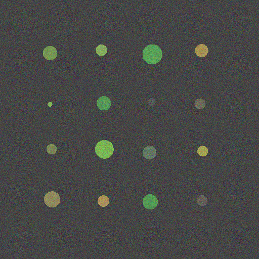
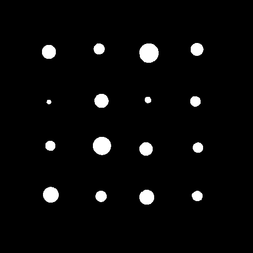
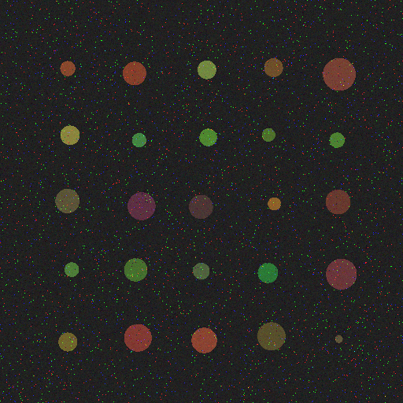
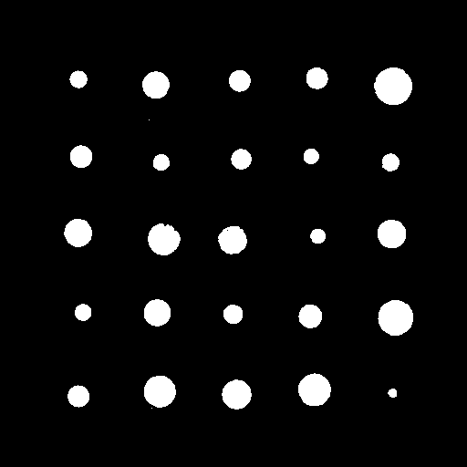

# Pytorch-Unet-2.0  for noisy image segmentation
Improved UNet CNN Deep Learning Image Segmentation for noisy images. More accurate, More stable. Trained for microarray images.

## Note
## [# Download the repository from here](https://github.com/upashu1/Pytorch-UNet-2)

Example results for the pre-trained models :

Input Image            |  Output Segmentation Image 
:-------------------------:|:-------------------------:
  |  
  |  

UNet 2.0 is a modified version of UNet for better segmentation even image is noisy. Below is the pictorial view difference between UNet and UNet 2.0.

[This](https://github.com/upashu1/Pytorch-UNet-2) is a forked version of https://github.com/milesial/Pytorch-UNet. To know more about it, 
[Click Here For Original Edition](https://github.com/milesial/Pytorch-UNet) 

## Usage
**Note : Use Python 3**

Download pretrained network [CP67.zip](https://www.amazon.com/clouddrive/share/1VsNFgJ1E6k83MjcLbrU2Z77fX1Nhm7YEpUxIIHZGi6) for noisy microarray images from [here](http://wix.to/2cAQBBA)
Unzip it (CP67.zip) in same folder. It should be now CP67.pth
Use checkoutput.py program to check output on your images.

For training on your images use train2.py. For training, program assumes input image size 512 x 512 which is broken by program into 128 x 128 for training.

There is no limitation of image size on testing/predicting/checking output.
